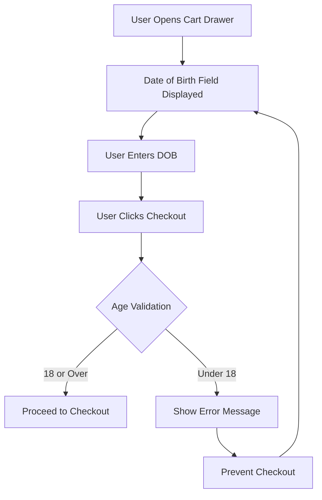

# Cart Age Verification Implementation Plan

## Overview
Add a date of birth field to the cart drawer that validates the user's age before allowing checkout. Users under 18 will see an error message and be prevented from proceeding to checkout.

## Requirements
- Date of birth input field positioned above the checkout button in cart summary
- Age calculation based on entered date of birth
- Validation on checkout button click
- Error message displayed below the date field when user is under 18
- Prevent checkout submission if user is under 18
- Maintain theme styling consistency
- Ensure accessibility compliance

## Architecture

### Component Flow


### File Modifications

#### 1. [`snippets/cart-summary.liquid`](snippets/cart-summary.liquid)
**Location**: Above the checkout button (line ~260-270)

**Changes**:
- Add date of birth input field with proper label and accessibility attributes
- Add hidden error message container
- Load the age verification JavaScript component
- Add data attributes to checkout button for validation hook

**New Elements**:
- Date input field with `type="date"`
- Label with `for` attribute for accessibility
- Error message container (initially hidden)
- Script tag to load validation component

#### 2. `assets/cart-age-verification.js` (New File)
**Purpose**: Handle age verification logic

**Functionality**:
- Calculate age from date of birth
- Validate age is 18 or over
- Show/hide error messages
- Prevent form submission if under 18
- Store validation state

**Key Methods**:
- `calculateAge(dateOfBirth)` - Calculate age from DOB
- `validateAge()` - Check if user is 18+
- `showError(message)` - Display error message
- `hideError()` - Hide error message
- `handleCheckoutClick(event)` - Intercept checkout button click

#### 3. [`snippets/cart-summary.liquid`](snippets/cart-summary.liquid) - Styling
**Location**: Within the existing `` block

**Styles to Add**:
- `.cart-age-verification` - Container styling
- `.cart-age-verification__label` - Label styling matching theme
- `.cart-age-verification__input` - Input field styling
- `.cart-age-verification__error` - Error message styling
- `.cart-age-verification__error--visible` - Show error state

## Implementation Details

### Date of Birth Field Specifications
- **Input Type**: `date` (native HTML5 date picker)
- **Required**: Yes
- **Max Date**: Today (prevent future dates)
- **Min Date**: 120 years ago (reasonable limit)
- **Placeholder**: "MM/DD/YYYY" or locale-appropriate format
- **Validation**: Client-side only (no server-side validation needed)

### Age Calculation Logic
```javascript
function calculateAge(dateOfBirth) {
  const today = new Date();
  const birthDate = new Date(dateOfBirth);
  let age = today.getFullYear() - birthDate.getFullYear();
  const monthDiff = today.getMonth() - birthDate.getMonth();
  
  if (monthDiff < 0 || (monthDiff === 0 && today.getDate() < birthDate.getDate())) {
    age--;
  }
  
  return age;
}
```

### Error Messages
- **Under 18**: "You must be 18 years or older to complete this purchase."
- **No Date Entered**: "Please enter your date of birth to continue."
- **Invalid Date**: "Please enter a valid date of birth."

### Checkout Button Behavior
1. User clicks checkout button
2. JavaScript intercepts the click event
3. Validates date of birth field is filled
4. Calculates age from entered date
5. If age >= 18: Allow form submission
6. If age < 18: Prevent submission and show error
7. If no date: Prevent submission and show error

### Accessibility Considerations
- Proper `<label>` element with `for` attribute
- ARIA attributes for error messages (`aria-live="polite"`, `role="alert"`)
- Error message associated with input via `aria-describedby`
- Keyboard navigation support
- Screen reader announcements for validation errors
- Focus management (focus on error when shown)

### Styling Approach
- Match existing cart input field styles (see `.cart-note__instructions` and `.cart-discount__input`)
- Use theme CSS variables for colors, spacing, and typography
- Responsive design (mobile and desktop)
- Error state styling with red color scheme
- Smooth transitions for error message appearance

### Integration Points

#### Cart Drawer Context
The date of birth field will appear in:
- Cart drawer (ajax cart)
- Cart page (if theme has one)

Both contexts use the same [`cart-summary.liquid`](snippets/cart-summary.liquid) snippet, so one implementation covers both.

#### Form Integration
- The field is part of the cart form (`form="cart-form"`)
- Validation happens before form submission
- No server-side changes needed (client-side only)

### Testing Checklist
- [ ] Date field appears above checkout button
- [ ] Date picker works on mobile and desktop
- [ ] Age calculation is accurate (test edge cases: birthdays today, leap years)
- [ ] Error message shows when user is under 18
- [ ] Error message shows when no date is entered
- [ ] Checkout is prevented when validation fails
- [ ] Checkout proceeds when user is 18+
- [ ] Error message is accessible to screen readers
- [ ] Keyboard navigation works properly
- [ ] Styling matches theme design
- [ ] Works in cart drawer and cart page
- [ ] Browser compatibility (Chrome, Firefox, Safari, Edge)

## Localization Considerations
- Error messages should be added to theme locale files for multi-language support
- Date format respects user's locale
- Consider adding translation keys to `locales/en.default.json`

## Future Enhancements (Optional)
- Store DOB in session storage to avoid re-entry
- Add option to remember DOB for returning customers
- Server-side validation for additional security
- Analytics tracking for age verification attempts
- Customizable age threshold (admin setting)

## Files to Create/Modify

### New Files
1. `assets/cart-age-verification.js` - Age verification component

### Modified Files
1. [`snippets/cart-summary.liquid`](snippets/cart-summary.liquid) - Add DOB field and validation
2. `locales/en.default.json` - Add translation strings (optional)

## Estimated Complexity
**Medium** - Requires JavaScript component creation, Liquid template modification, and styling integration.
