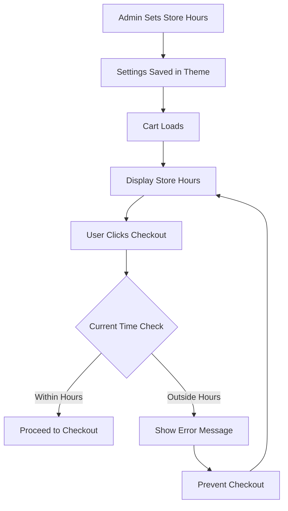

# Store Hours Validation Implementation Plan

## Overview
Add customizable store hours to the Shopify theme admin panel and implement time-based checkout validation. Display store hours in the cart and prevent checkout outside of operating hours with an error message.

## Requirements
- Admin-configurable store hours (opening and closing times)
- Display store hours in cart (e.g., "Store Hours: 9am - 5pm")
- Validate current time against store hours on checkout
- Show error message when attempting checkout outside hours
- Prevent checkout submission when store is closed
- Consider timezone handling (store timezone vs customer timezone)

## Architecture

### Component Flow


### File Modifications

#### 1. [`config/settings_schema.json`](config/settings_schema.json:1666-1826)
**Location**: Within the "Cart" settings section (after line 1826)

**Changes**:
- Add new header for "Store Hours"
- Add checkbox to enable/disable store hours validation
- Add time input for opening time
- Add time input for closing time
- Add timezone select (optional)
- Add text input for custom hours display message

**New Settings**:
```json
{
  "type": "header",
  "content": "Store Hours"
},
{
  "type": "checkbox",
  "id": "enable_store_hours",
  "label": "Enable store hours validation",
  "default": false
},
{
  "type": "text",
  "id": "store_opening_time",
  "label": "Opening time (24-hour format)",
  "default": "09:00",
  "info": "Format: HH:MM (e.g., 09:00 for 9am)"
},
{
  "type": "text",
  "id": "store_closing_time",
  "label": "Closing time (24-hour format)",
  "default": "17:00",
  "info": "Format: HH:MM (e.g., 17:00 for 5pm)"
},
{
  "type": "text",
  "id": "store_hours_display",
  "label": "Store hours display text",
  "default": "Store Hours: 9am - 5pm",
  "info": "This text will be shown in the cart"
}
```

#### 2. [`snippets/cart-summary.liquid`](snippets/cart-summary.liquid)
**Location**: Above the age verification section (before line 260)

**Changes**:
- Add conditional block to display store hours if enabled
- Include store hours display text from settings
- Load store hours validation JavaScript

**New Elements**:
- Store hours display section
- Script tag for validation component

#### 3. `assets/cart-store-hours.js` (New File)
**Purpose**: Handle store hours validation logic

**Functionality**:
- Parse store opening and closing times from settings
- Get current time in appropriate timezone
- Validate if current time is within store hours
- Show/hide error messages
- Prevent checkout if outside hours
- Integrate with existing age verification

**Key Methods**:
- `parseTime(timeString)` - Parse HH:MM format to time object
- `getCurrentTime()` - Get current time
- `isWithinStoreHours()` - Check if current time is within hours
- `showStoreClosedError()` - Display error message
- `hideStoreClosedError()` - Hide error message
- `handleCheckoutClick(event)` - Intercept checkout with hours check

#### 4. [`assets/cart-age-verification.js`](assets/cart-age-verification.js)
**Modification**: Update to work alongside store hours validation

**Changes**:
- Ensure both validations run before checkout
- Coordinate error message display
- Prevent checkout if either validation fails

## Implementation Details

### Admin Settings Structure

**Store Hours Settings in Theme Customizer**:
- Located in: Theme Settings > Cart > Store Hours
- Enable/disable toggle for the feature
- Time inputs using 24-hour format (HH:MM)
- Custom display text for flexibility
- Optional timezone selection

### Store Hours Display

**Display Format**:
- Simple text display above checkout button
- Styled to match cart typography
- Shows custom message from admin settings
- Example: "Store Hours: 9am - 5pm"

**Styling**:
- Match existing cart text styles
- Use theme typography variables
- Subtle, informative appearance
- Responsive design

### Time Validation Logic

**Time Parsing**:
```javascript
function parseTime(timeString) {
  const [hours, minutes] = timeString.split(':').map(Number);
  const now = new Date();
  const time = new Date(now.getFullYear(), now.getMonth(), now.getDate(), hours, minutes);
  return time;
}
```

**Validation Check**:
```javascript
function isWithinStoreHours(openingTime, closingTime) {
  const now = new Date();
  const opening = parseTime(openingTime);
  const closing = parseTime(closingTime);
  
  return now >= opening && now <= closing;
}
```

### Error Messages

**Store Closed Message**:
- "Sorry, our store is currently closed. Please check back during store hours: [hours]"
- Displayed below store hours display
- Red error styling matching age verification errors
- Accessible with ARIA attributes

### Timezone Considerations

**Approach Options**:

1. **Simple (Recommended for MVP)**:
   - Use browser's local time
   - Assume customer and store are in same timezone
   - Simpler implementation
   - Works for local/regional stores

2. **Advanced (Future Enhancement)**:
   - Add timezone setting in admin
   - Convert times to store timezone
   - More complex but accurate for international stores
   - Requires timezone library

**Initial Implementation**: Use browser local time for simplicity

### Integration with Age Verification

**Combined Validation Flow**:
1. User clicks checkout
2. Age verification runs first
3. If age valid, store hours validation runs
4. If both valid, checkout proceeds
5. If either fails, show appropriate error

**Coordination**:
- Both validations must pass
- Errors display independently
- Clear which validation failed
- Prevent checkout if any validation fails

### Styling Approach

**Store Hours Display**:
```css
.cart-store-hours {
  display: block;
  width: 100%;
  margin-block-end: var(--margin-sm);
  padding: var(--padding-sm) var(--padding-md);
  background-color: rgb(var(--color-foreground-rgb) / 0.05);
  border-radius: var(--style-border-radius-inputs);
}

.cart-store-hours__text {
  font-size: var(--cart-font-size--sm);
  color: var(--color-foreground);
  text-align: center;
}

.cart-store-hours__error {
  display: none;
  color: var(--color-error, #d32f2f);
  font-size: var(--cart-font-size--xs);
  margin-block-start: var(--margin-2xs);
  padding: var(--padding-xs) var(--padding-sm);
  background-color: rgb(211 47 47 / 0.1);
  border-radius: var(--style-border-radius-inputs);
}

.cart-store-hours__error--visible {
  display: block;
}
```

### Accessibility Considerations

- Proper ARIA labels for store hours display
- Error messages with `role="alert"`
- Screen reader announcements for validation errors
- Keyboard navigation support
- Focus management on error display

### Testing Checklist

- [ ] Admin settings save correctly
- [ ] Store hours display shows in cart
- [ ] Time validation works correctly
- [ ] Error message appears when store is closed
- [ ] Checkout is prevented outside hours
- [ ] Checkout proceeds during store hours
- [ ] Works with age verification
- [ ] Both validations can fail independently
- [ ] Error messages are accessible
- [ ] Styling matches theme
- [ ] Works in cart drawer and cart page
- [ ] Time parsing handles edge cases (midnight, etc.)

## Localization Considerations

**Translation Keys to Add**:
- `content.store_hours` - "Store Hours"
- `content.store_closed_error` - "Sorry, our store is currently closed. Please check back during store hours."

**Admin Settings Labels**:
- Already in English in schema
- Shopify admin handles translation

## Future Enhancements (Optional)

1. **Day-Specific Hours**:
   - Different hours for different days of the week
   - Closed days (e.g., Sundays)
   - Holiday hours

2. **Timezone Support**:
   - Store timezone setting
   - Automatic timezone conversion
   - Display hours in customer's timezone

3. **Multiple Time Ranges**:
   - Split shifts (e.g., 9am-12pm, 2pm-5pm)
   - Lunch breaks

4. **Advanced Display**:
   - Show "Open Now" or "Closed" status
   - Countdown to opening/closing
   - Weekly schedule display

5. **Server-Side Validation**:
   - Additional validation on checkout
   - Prevent bypassing client-side checks

## Files to Create/Modify

### New Files
1. `assets/cart-store-hours.js` - Store hours validation component
2. `plans/store-hours-validation-plan.md` - This plan document

### Modified Files
1. [`config/settings_schema.json`](config/settings_schema.json) - Add store hours settings
2. [`snippets/cart-summary.liquid`](snippets/cart-summary.liquid) - Add hours display and validation
3. [`assets/cart-age-verification.js`](assets/cart-age-verification.js) - Coordinate with hours validation
4. [`locales/en.default.json`](locales/en.default.json) - Add translation strings

## Estimated Complexity
**Medium** - Requires admin settings configuration, time validation logic, and integration with existing cart validation.
